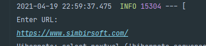

# testWorkForSimbirsoft

## Create with
- Maven - is software project management and comprehension tool.
- Travis CI -  is a continuous integration platform that takes care of running your software tests and deploying your apps
- Jacoco - is a software metric used to measure how many lines of our code are executed during automated tests.
- Checkstyle - tool for checking Java source code.

## Features

- The program parse website.
- The program read all text
- The program splits the text into separate words
- The program counts the number of separated words
- The program write words and numbers to the database.
- In the end the program outputs the received data to the console.

## Getting Started
javac Runner.java
java Runner
### then the program ask you inter URL for parsing

### result
